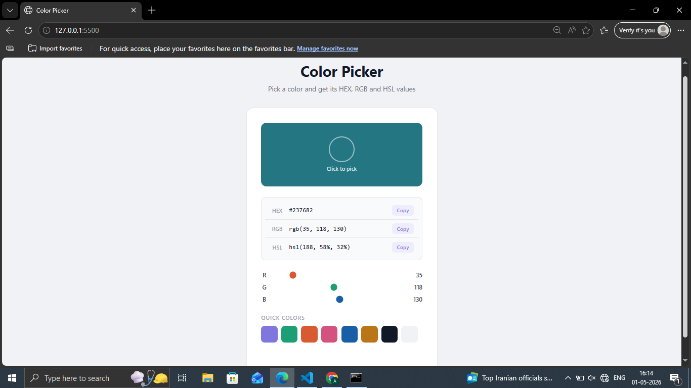

# Day 10 — Color Picker Tool

An interactive color picker that shows HEX, RGB and HSL values instantly.

## Preview

## Features
- Color wheel picker to select any color
- Live HEX, RGB and HSL value display
- RGB sliders to fine-tune colors
- One-click copy for each color format
- Quick color palette with 8 preset colors
- Toast notification on copy

## Tech Stack
- HTML5
- CSS3 (transitions, accent-color)
- JavaScript (color conversion, clipboard API)

## What I Learned
- Converting HEX to RGB and RGB to HSL
- Using the Clipboard API to copy text
- Syncing multiple inputs (color picker + sliders)
- Real-time DOM updates with oninput

## Part of
[30 Days 30 Projects](https://github.com/anmisha-dash/30-days-30-projects) challenge